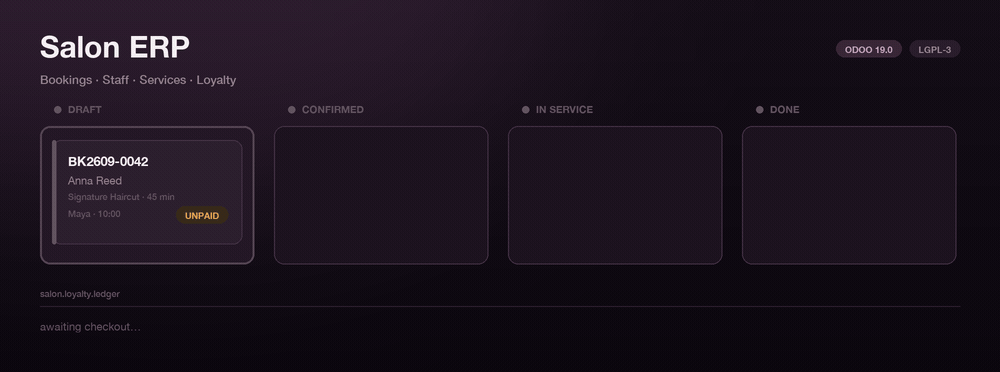
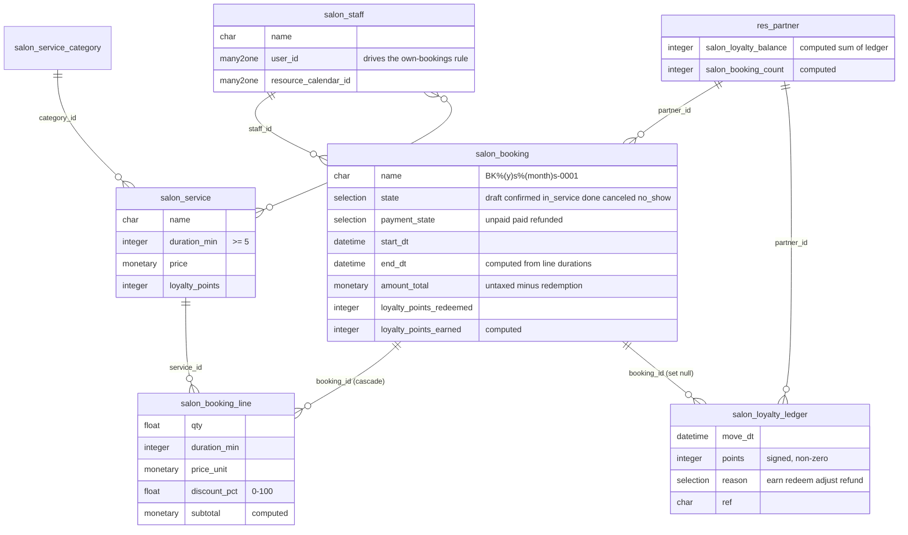
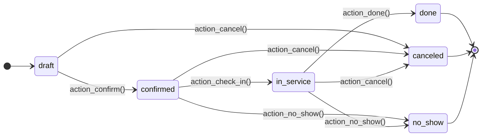
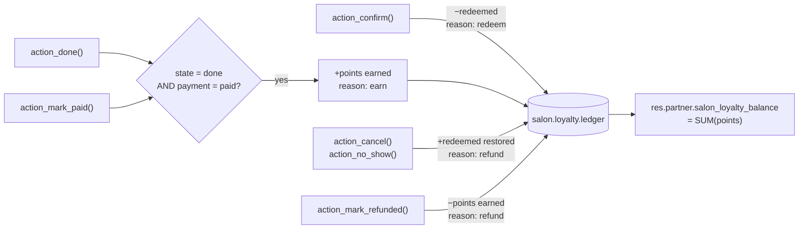

<div align="center">



# Salon ERP

**An Odoo 19 application for salon and spa operations: appointments, staff, services and a customer loyalty ledger.**

[](https://github.com/Chirudeva-Reddy/odoo-salon-erp/actions/workflows/ci.yml)
[](https://www.odoo.com)
[](https://www.gnu.org/licenses/lgpl-3.0)

</div>

---

## Run it in one command

The repository root **is** the Odoo module, so Compose mounts it at the path Odoo expects and installs it with demo data on first boot:

```bash
docker compose up
```

Open <http://localhost:8069>, log in as `admin` / `admin`, and the **Salon** menu is already populated with demo services, staff and bookings.

```bash
docker compose down -v    # stop and wipe the database
```

<details>
<summary><b>Installing into an existing Odoo instead</b></summary>

Odoo resolves a module by its **directory name**, which must be `salon_erp`:

```bash
git clone https://github.com/Chirudeva-Reddy/odoo-salon-erp.git salon_erp
```

Point `odoo.conf` at the parent directory, restart, then install:

```ini
addons_path = /path/to/custom_addons,/path/to/odoo/addons
```

```bash
./odoo-bin -c odoo.conf -d yourdb -i salon_erp --stop-after-init
```

Or install from the UI: enable Developer Mode → **Apps** → **Update Apps List** → search **Salon ERP**.

Requires Odoo **19.0** (Community or Enterprise). Depends on `base`, `mail`, `resource` — all core.

</details>

---

## What it does

| | |
| :-- | :-- |
| 📅 **Appointments** | Full lifecycle from draft to checkout, with list, form, kanban and calendar views. |
| 🚫 **Double-booking prevention** | A database-backed constraint blocks a staff member from being booked twice over the same interval. |
| ✂️ **Service catalogue** | Categorised services with default duration, price and loyalty value; booking lines inherit them and stay editable. |
| 👤 **Staff** | Working-hours calendar, service specialisations, and a record rule that limits stylists to their own appointments. |
| 🎁 **Loyalty ledger** | Append-only point movements. Points are redeemed on confirmation, earned on paid completion, and reversed on cancellation or refund. |
| 🔔 **Reminders** | An hourly cron notifies customers whose confirmed appointment falls inside the configured lead time. |
| 📊 **Reporting** | Graph and pivot views over volume, revenue and loyalty output by staff and state. |
| 🏢 **Multi-company** | Every model is company-scoped, with record rules and cross-company validation. |

---

## Data model

Six models, plus two computed stat fields grafted onto `res.partner`. Entity names below use `_` where Odoo uses `.` (`salon_booking` is `salon.booking`).



---

## Booking lifecycle

Every transition is a guarded method on `salon.booking` — the buttons in the form view call these, and so does any external integration.



**`action_confirm()` refuses** unless the booking has at least one service line, a total duration above zero, redeemed points within the customer's balance, a redemption value no larger than the line total, and a staff member who is free. Every other transition is guarded too: a booking can only be completed from `in_service`, only cancelled before it is done, and only marked paid while it is unpaid and not cancelled.

**The overlap rule.** Confirming or rescheduling checks for any booking of the *same staff member in the same company* whose interval intersects on a half-open basis (`start < other.end AND end > other.start`), counting only `confirmed`, `in_service` and `done`. Draft bookings deliberately do not block — the salon can pencil in options and let confirmation arbitrate. The check runs with elevated privileges, because record rules would otherwise hide a genuine conflict from the user making the booking.

---

## How loyalty points move

`salon.loyalty.ledger` is append-only: `write()` and `unlink()` raise, so a customer's balance is always the signed sum of an immutable audit trail rather than a mutable counter.



Points are earned once **both** conditions hold, so completion and payment can happen in either order. Four `has_*` flags on the booking make each movement idempotent — replaying a transition never double-credits.

---

## Access control

Three groups, mapped from `security/ir.model.access.csv` and `security/salon_security.xml`:

| Model | Salon / User | Salon / Staff | Salon / Administrator |
| :--- | :---: | :---: | :---: |
| `salon.booking` | read write create delete | read write | read write create delete |
| `salon.booking.line` | read write create delete | read | read write create delete |
| `salon.service` | read | read | read write create delete |
| `salon.service.category` | read | read | read write create delete |
| `salon.staff` | read | read | read write create delete |
| `salon.loyalty.ledger` | read | — | read create |

Nobody gets write or delete on the ledger, including administrators — the model itself refuses them.

Two record rules apply on top:

- **Company scope** — every salon model is filtered to `company_id in company_ids`.
- **Own bookings** — the *Staff* group additionally sees only bookings where `staff_id.user_id` is the current user, so a stylist opens their own day and not the whole salon's.

---

## Configuration

**Settings → General Settings → Salon** (visible to Salon Administrators):

| Setting | System parameter | Default | Effect |
| :--- | :--- | :--- | :--- |
| Loyalty Point Value | `salon_erp.point_value` | `1.0` | Currency value of one point when redeemed against a booking. |
| Reminder Lead Time | `salon_erp.reminder_hours` | `24` | How far ahead the hourly **Salon: Booking Reminders** cron notifies customers. Rescheduling a booking re-arms its reminder. |

---

## Tests

13 tests across three suites — booking conflicts and record-rule visibility, loyalty arithmetic, and reminder/payment guards.

```bash
docker compose run --rm odoo odoo -d test_salon -i salon_erp \
  --test-enable --test-tags=/salon_erp --stop-after-init --max-cron-threads=0
```

Against a local checkout:

```bash
./odoo-bin -c odoo.conf -d test_salon -i salon_erp --test-enable --test-tags=/salon_erp --stop-after-init
```

CI runs exactly this on every push, installing the module into a clean `odoo:19.0` container against PostgreSQL 16.

---

## Layout

```
salon_erp/
├── models/            6 models + res.partner and res.config.settings extensions
├── views/             list, form, kanban, calendar, graph, pivot, search, menus
├── security/          groups, record rules, model ACLs
├── data/              booking sequence, reminder cron
├── demo/              services, staff, customers and sample bookings
├── tests/             13 tests
├── docs/              README banner + the script that renders it
├── docker-compose.yml Odoo 19 + PostgreSQL 16
└── __manifest__.py
```

Regenerate the banner and app icon with `python3 docs/make_assets.py`.

---

## License

[LGPL-3.0](https://www.gnu.org/licenses/lgpl-3.0). Not affiliated with or endorsed by Odoo S.A.
