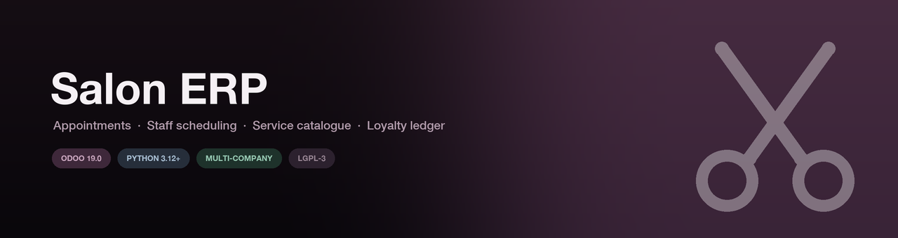
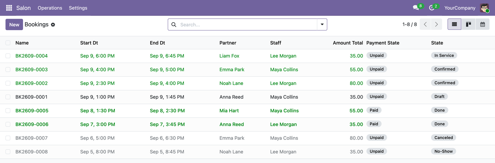
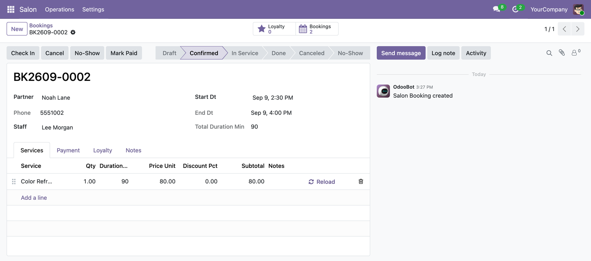
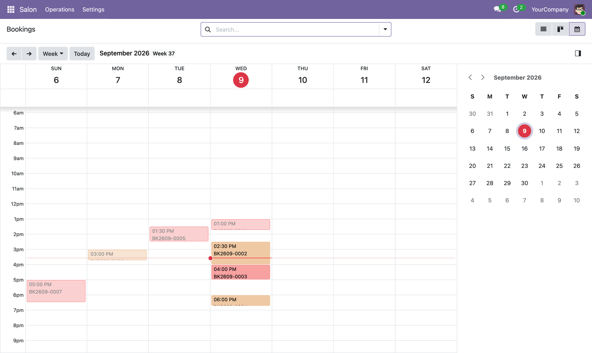
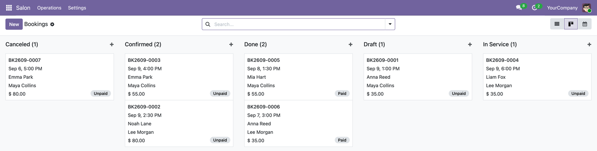
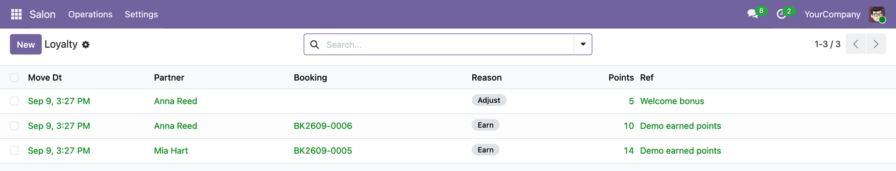
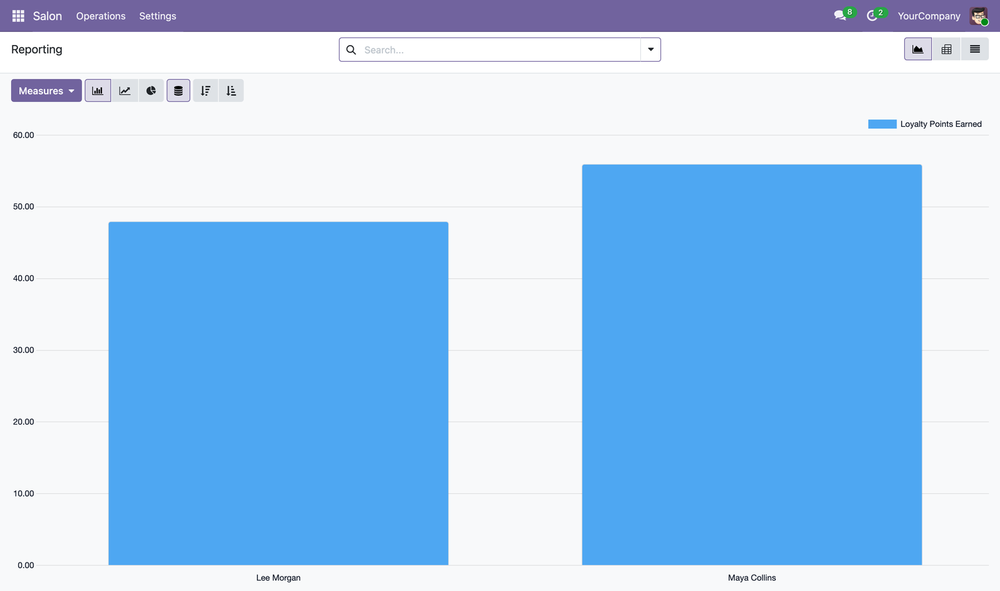
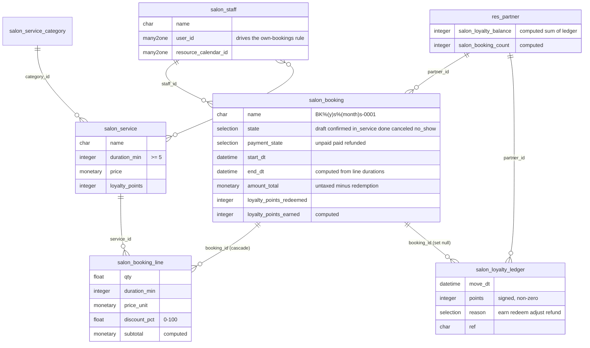
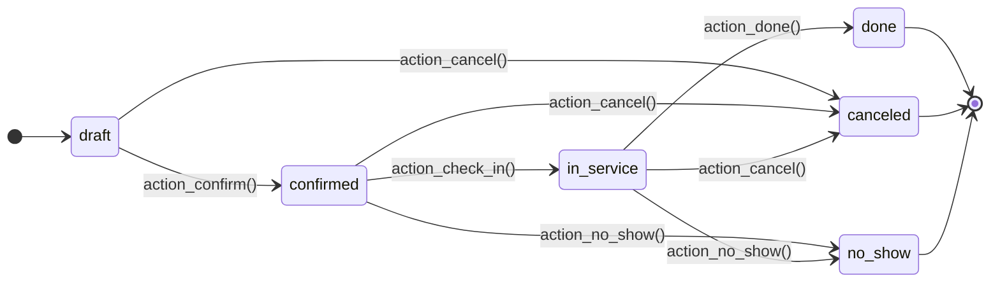
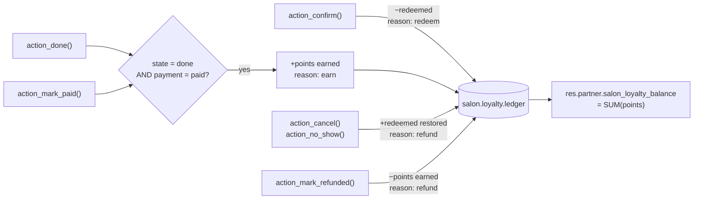

<h1 align="center">Welcome to Salon ERP 👋</h1>

<p align="center">
  <a href="https://github.com/Chirudeva-Reddy/odoo-salon-erp/actions/workflows/ci.yml" target="_blank">
    
  </a>
  
  
  
  <a href="#-documentation" target="_blank">
    
  </a>
  <a href="https://github.com/Chirudeva-Reddy/odoo-salon-erp/graphs/commit-activity" target="_blank">
    
  </a>
  <a href="https://github.com/Chirudeva-Reddy/odoo-salon-erp/blob/main/LICENSE" target="_blank">
    
  </a>
</p>

> An Odoo 19 application for salon and spa operations — appointments with staff double-booking prevention, a service catalogue, and an append-only customer loyalty ledger.

<p align="center">
  <a href="#-quick-start"><b>Quick start</b></a> ·
  <a href="#-screens"><b>Screens</b></a> ·
  <a href="#-how-it-works"><b>How it works</b></a> ·
  <a href="#-access-control"><b>Security</b></a> ·
  <a href="#-run-tests"><b>Tests</b></a>
</p>

---

<a id="-documentation"></a>
<details>
<summary><b>📖 Table of contents</b> — click to expand</summary>

- [⚡ Quick start](#-quick-start)
- [🔧 Prerequisites](#-prerequisites)
- [✨ Features](#-features)
- [🖼️ Screens](#-screens)
- [🎬 The booking lifecycle, animated](#-the-booking-lifecycle-animated)
- [🧠 How it works](#-how-it-works)
  - [Data model](#data-model)
  - [Booking lifecycle](#booking-lifecycle)
  - [How loyalty points move](#how-loyalty-points-move)
- [🔐 Access control](#-access-control)
- [⚙️ Configuration](#-configuration)
- [🧪 Run tests](#-run-tests)
- [📁 Project layout](#-project-layout)
- [🗺️ Scope](#-scope)
- [❓ Troubleshooting](#-troubleshooting)
- [🤝 Contributing](#-contributing)
- [👤 Author](#-author)
- [📝 License](#-license)

</details>

---

<a id="-quick-start"></a>

## ⚡ Quick start

The repository root **is** the Odoo module, so Compose mounts it where Odoo expects and installs it with demo data on first boot:

```sh
docker compose up
```

Then open **<http://localhost:8069>** and log in as `admin` / `admin`. The **Salon** menu already holds demo services, staff and a week of bookings.

```sh
docker compose down -v   # stop and wipe the database
```

<details>
<summary><b>Install into an existing Odoo instead</b></summary>

<br/>

Odoo resolves a module by its **directory name**, which must be `salon_erp`:

```sh
git clone https://github.com/Chirudeva-Reddy/odoo-salon-erp.git salon_erp
```

Point `odoo.conf` at the parent directory:

```ini
addons_path = /path/to/custom_addons,/path/to/odoo/addons
```

Then install from the CLI:

```sh
./odoo-bin -c odoo.conf -d yourdb -i salon_erp --with-demo --stop-after-init
```

Drop `--with-demo` for a clean database — Odoo 19 omits demo data by default.

Or install from the UI: enable Developer Mode → **Apps** → **Update Apps List** → search **Salon ERP**.

</details>

<details>
<summary><b>Run it from source, without Docker</b></summary>

<br/>

Needs PostgreSQL running locally and a Python 3.12+ virtualenv:

```sh
git clone --depth 1 -b 19.0 https://github.com/odoo/odoo.git odoo-src
python3 -m venv venv && ./venv/bin/pip install -r odoo-src/requirements.txt
mkdir -p custom_addons && ln -s "$PWD/odoo-salon-erp" custom_addons/salon_erp
./venv/bin/python odoo-src/odoo-bin \
  --addons-path="$PWD/odoo-src/addons,$PWD/custom_addons" \
  -d salon_demo -i salon_erp --with-demo
```

On macOS, install `psycopg2-binary` instead of `psycopg2` — the source build links against a Postgres.app path that moves between versions.

</details>

<a id="-prerequisites"></a>

## 🔧 Prerequisites

| | |
| :--- | :--- |
| **Odoo** | 19.0 (Community or Enterprise) |
| **Python** | 3.12+ |
| **PostgreSQL** | 12+ |
| **Odoo modules** | `base`, `mail`, `resource` — all core, no third-party dependencies |

<p align="right"><a href="#-documentation">⬆ back to top</a></p>

<a id="-features"></a>

## ✨ Features

| | |
| :-- | :-- |
| 📅 **Appointments** | Full lifecycle from draft to checkout, in list, form, kanban and calendar views. |
| 🚫 **No double-booking** | A validation constraint blocks a staff member being booked twice over the same interval. |
| ✂️ **Service catalogue** | Categorised services with default duration, price and loyalty value; booking lines inherit them and stay editable. |
| 👤 **Staff** | Working-hours calendar, service specialisations, and a record rule that limits stylists to their own appointments. |
| 🎁 **Loyalty ledger** | Append-only point movements — redeemed on confirmation, earned on paid completion, reversed on cancellation or refund. |
| 🔔 **Reminders** | An hourly cron notifies customers whose confirmed appointment falls inside the configured lead time. |
| 📊 **Reporting** | Graph and pivot views over volume, revenue and loyalty output by staff and state. |
| 🏢 **Multi-company** | Every model is company-scoped, with record rules and cross-company validation. |

<p align="right"><a href="#-documentation">⬆ back to top</a></p>

<a id="-screens"></a>

## 🖼️ Screens

Captured from this module running on Odoo 19 with its demo data.

**Bookings** — every state in one list. Confirmed, in-service and done bookings are highlighted; cancellations and no-shows are muted.



**A booking** — the workflow buttons are the guarded methods from the [state machine](#booking-lifecycle), beside the service lines, loyalty stat button and chatter.



<details>
<summary><b>📅 Calendar and pipeline</b></summary>

<br/>

The same records as a stylist's week, and as a board grouped by state.

<table>
<tr>
<td width="50%"></td>
<td width="50%"></td>
</tr>
</table>

</details>

<details>
<summary><b>🎁 Loyalty ledger and reporting</b></summary>

<br/>

An append-only trail — a manual welcome bonus plus two earn entries, each linked back to the booking that produced it.



Graph and pivot views over booking volume, revenue and loyalty output.



</details>

<p align="right"><a href="#-documentation">⬆ back to top</a></p>

<a id="-the-booking-lifecycle-animated"></a>

## 🎬 The booking lifecycle, animated

A booking walking the state machine while the loyalty ledger posts its entry. This one is a diagram, not a screen recording.


<p align="right"><a href="#-documentation">⬆ back to top</a></p>

<a id="-how-it-works"></a>

## 🧠 How it works

### Data model

Six models, plus computed stat fields grafted onto `res.partner`. Entity names below use `_` where Odoo uses `.` (`salon_booking` is `salon.booking`).



### Booking lifecycle

Every transition is a guarded method on [`salon.booking`](models/salon_booking.py) — the form buttons call these, and so does any external integration.



**`action_confirm()` refuses** unless the booking has at least one service line, a total duration above zero, redeemed points within the customer's balance, a redemption value no larger than the line total, and a staff member who is free. Every other transition is guarded too: a booking can only be completed from `in_service`, only cancelled before it is done, and only marked paid while it is unpaid and not cancelled.

<details>
<summary><b>The overlap rule, in detail</b></summary>

<br/>

Confirming or rescheduling searches for any booking of the *same staff member in the same company* whose interval intersects on a **half-open** basis:

```
start < other.end  AND  end > other.start
```

Only `confirmed`, `in_service` and `done` count. Two appointments that merely touch — one ending at 12:00, the next starting at 12:00 — do **not** conflict.

Draft bookings deliberately do not block, so the salon can pencil in options and let confirmation arbitrate.

The search runs with elevated privileges. Without that, the *Staff* record rule (which narrows a stylist to their own bookings) would hide a genuine conflict from the very user creating it, and the constraint would pass on a double-booking.

</details>

### How loyalty points move

[`salon.loyalty.ledger`](models/salon_loyalty_ledger.py) is append-only: `write()` and `unlink()` raise on any non-empty recordset, so a balance is always the signed sum of an immutable trail rather than a mutable counter.



Points are earned once **both** conditions hold, so completion and payment may happen in either order. Four `has_*` flags on the booking make each movement idempotent — replaying a transition never double-credits.

<p align="right"><a href="#-documentation">⬆ back to top</a></p>

<a id="-access-control"></a>

## 🔐 Access control

Three groups, from [`ir.model.access.csv`](security/ir.model.access.csv) and [`salon_security.xml`](security/salon_security.xml):

| Model | Salon / User | Salon / Staff | Salon / Administrator |
| :--- | :---: | :---: | :---: |
| `salon.booking` | read write create delete | read write | read write create delete |
| `salon.booking.line` | read write create delete | read | read write create delete |
| `salon.service` | read | read | read write create delete |
| `salon.service.category` | read | read | read write create delete |
| `salon.staff` | read | read | read write create delete |
| `salon.loyalty.ledger` | read | — | read create |

Nobody gets write or delete on the ledger, administrators included — the model itself refuses them.

<details>
<summary><b>Record rules layered on top</b></summary>

<br/>

- **Company scope** — every salon model is filtered to `company_id in company_ids`.
- **Own bookings** — the *Staff* group additionally sees only bookings where `staff_id.user_id` is the current user, so a stylist opens their own day rather than the whole salon's.

Both rules are covered by `test_record_rules_limit_company_and_staff_visibility`.

</details>

<p align="right"><a href="#-documentation">⬆ back to top</a></p>

<a id="-configuration"></a>

## ⚙️ Configuration

**Settings → General Settings → Salon**, visible to Salon Administrators:

| Setting | System parameter | Default | Effect |
| :--- | :--- | :--- | :--- |
| Loyalty Point Value | `salon_erp.point_value` | `1.0` | Currency value of one point when redeemed against a booking. |
| Reminder Lead Time | `salon_erp.reminder_hours` | `24` | How far ahead the hourly **Salon: Booking Reminders** cron notifies customers. Rescheduling a booking re-arms its reminder. |

<a id="-run-tests"></a>

## 🧪 Run tests

13 tests across three suites — booking conflicts and record-rule visibility, loyalty arithmetic, and reminder/payment guards.

```sh
docker compose run --rm odoo odoo -d test_salon -i salon_erp \
  --test-enable --test-tags=/salon_erp --stop-after-init --max-cron-threads=0
```

Against a local checkout:

```sh
./odoo-bin -c odoo.conf -d test_salon -i salon_erp --test-enable --test-tags=/salon_erp --stop-after-init
```

CI runs exactly this on every push, installing the module **with demo data** into a clean `odoo:19.0` container against PostgreSQL 16.

<p align="right"><a href="#-documentation">⬆ back to top</a></p>

<a id="-project-layout"></a>

## 📁 Project layout

```
salon_erp/
├── models/            6 models + res.partner and res.config.settings extensions
├── views/             list, form, kanban, calendar, graph, pivot, search, menus
├── security/          groups, record rules, model ACLs
├── data/              booking sequence, reminder cron
├── demo/              services, staff, customers, 8 bookings across every state
├── tests/             13 tests
├── docs/              banner, animated diagram, UI screenshots, asset script
├── static/description icon.png for the Odoo Apps tile
├── docker-compose.yml Odoo 19 + PostgreSQL 16
└── __manifest__.py
```

Regenerate the banner, animation and app icon with `python3 docs/make_assets.py`.

<a id="-scope"></a>

## 🗺️ Scope

What the module does today, and what it deliberately does not:

- [x] Appointment lifecycle with guarded transitions
- [x] Staff double-booking prevention
- [x] Service catalogue with categories
- [x] Append-only loyalty ledger with earn, redeem and reversal
- [x] Hourly appointment reminders
- [x] Multi-company record rules and per-stylist visibility
- [x] Graph and pivot reporting
- [ ] Customer-facing online booking portal
- [ ] SMS reminders — notifications currently go through `mail` only
- [ ] Invoicing or POS integration — no `account` dependency
- [ ] Enforcing staff working hours; `resource_calendar_id` is stored but not yet validated against

<a id="-troubleshooting"></a>

## ❓ Troubleshooting

<details>
<summary><b>The Salon menu is empty after <code>docker compose up</code></b></summary>

<br/>

Odoo 19 defaults to `--without-demo`. The Compose command passes `--with-demo` explicitly; if you install by hand, add that flag or create records yourself.

</details>

<details>
<summary><b>Odoo cannot find the module</b></summary>

<br/>

Odoo resolves modules by **directory name**, not by the `name` in the manifest. The folder must be called `salon_erp`, which is why the clone command above ends with `salon_erp` and why Compose mounts the repo at `/mnt/extra-addons/salon_erp`.

</details>

<details>
<summary><b>"Booking conflict: the selected staff member is already booked"</b></summary>

<br/>

Expected — another `confirmed`, `in_service` or `done` booking for that stylist overlaps this one. Intervals are half-open, so back-to-back appointments are fine; genuine overlaps are not. Move the time, pick another stylist, or leave the booking in `draft`, which never blocks.

</details>

<p align="right"><a href="#-documentation">⬆ back to top</a></p>

<a id="-contributing"></a>

## 🤝 Contributing

Contributions, issues and feature requests are welcome. Feel free to check the [issues page](https://github.com/Chirudeva-Reddy/odoo-salon-erp/issues).

CI must stay green: it installs the module into a clean Odoo 19 with demo data and runs the full suite. New behaviour should arrive with a test in [`tests/`](tests).

<a id="-author"></a>

## 👤 Author

**Chirudeva Reddy**

* GitHub: [@Chirudeva-Reddy](https://github.com/Chirudeva-Reddy)

## Show your support

Give a ⭐️ if this project helped you!

<a id="-license"></a>

## 📝 License

Copyright © 2026 [Chirudeva Reddy](https://github.com/Chirudeva-Reddy).<br />
This project is [LGPL-3.0](LICENSE) licensed. Not affiliated with or endorsed by Odoo S.A.

***

_README structure scaffolded with [readme-md-generator](https://github.com/kefranabg/readme-md-generator)_
